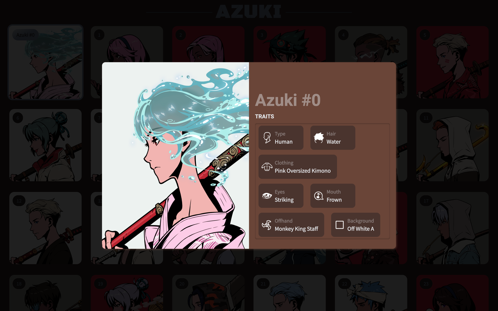

# Azuki NFT | QuickNode Powered DApp

<div align="center">
    
</div>

### Table of Content

- [About Azuki](#about-azuki)
- [Getting Started](#getting-started)
- [Learn More](#learn-more)

## About Azuki

In 2022, [Azuki](https://www.azuki.com/) set out to create a decentralized anime brand, where the community can co-create and contribute to the IP and stories we tell, forging a new model of community-driven entertainment._(copied)_

## Getting Started

First, run the development server:

```bash
npm run dev
# or
yarn dev
# or
pnpm dev
# or
bun dev
```

Open [http://localhost:3000](http://localhost:3000) with your browser to see the result.

You can start editing the page by modifying `app/page.tsx`. The page auto-updates as you edit the file.

This project uses [`next/font`](https://nextjs.org/docs/basic-features/font-optimization) to automatically optimize and load Inter, a custom Google Font.

## Learn More

To learn more about QuickNode, take a look at the following resources:

- [QuickNode Documentation](https://www.quicknode.com/docs/welcome) - learn about QuickNode features and API.
